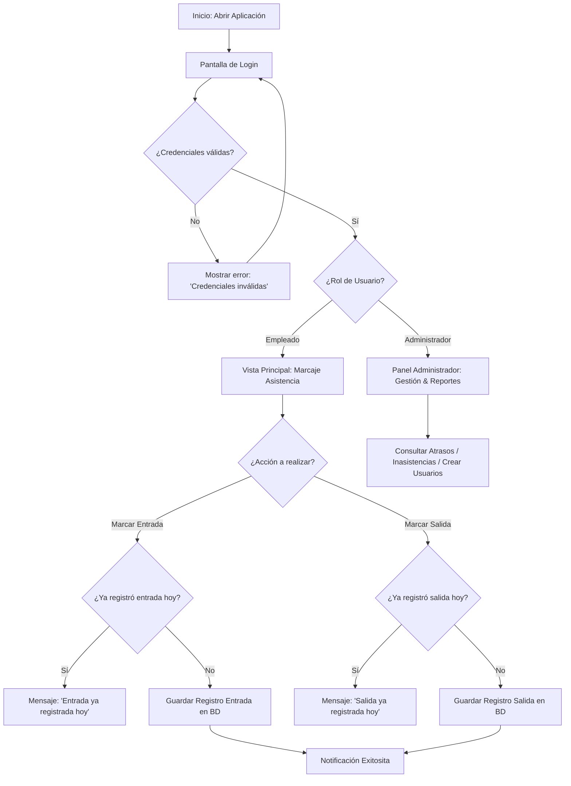
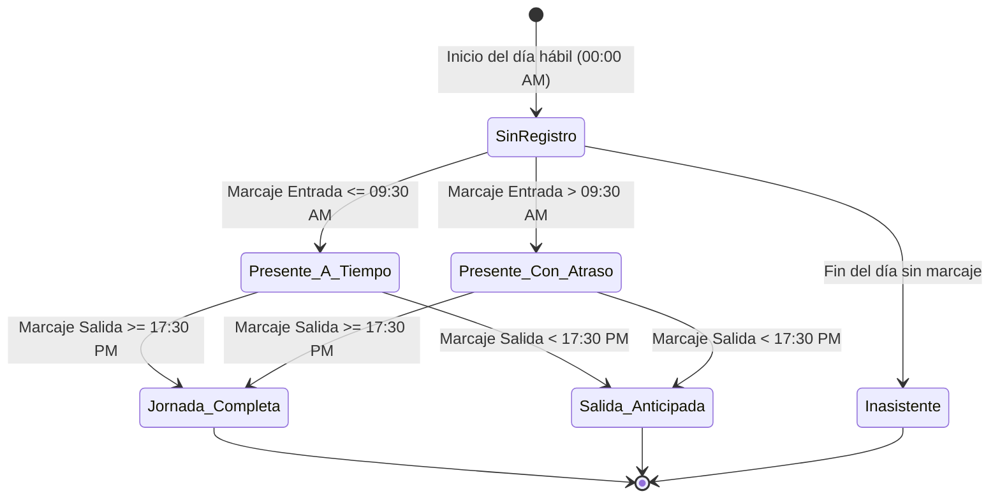
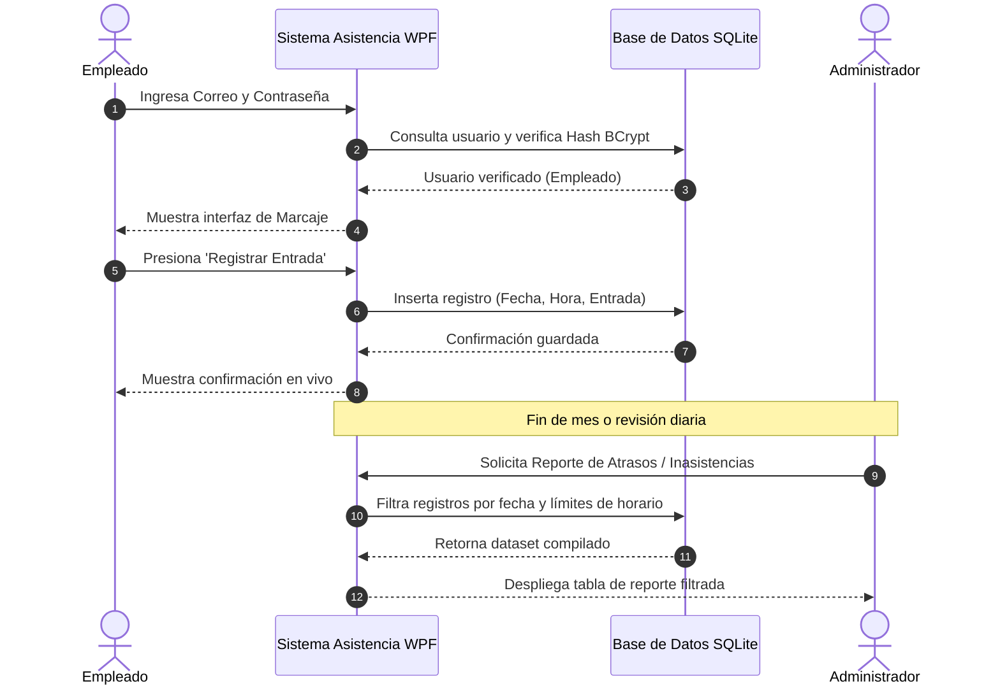

# 📐 Diagramas de Análisis y Diseño de Software

Este documento contiene la especificación y representación gráfica de los diagramas de análisis y diseño complementarios solicitados en la pauta de evaluación.

---

## 1. 🔄 Diagrama de Flujo (Autenticación y Registro de Asistencia)

El siguiente flujo describe las decisiones y transiciones desde el inicio de sesión del empleado/administrador hasta el marcaje de entrada o salida.

---

## 2. 📊 Diagrama de Estados (Registro de Asistencia Diario)

Describe las transiciones de estado por las que atraviesa la jornada de un empleado en un día hábil determinado.

---

## 3. ⚙️ Diagrama de Proceso (BPMN / Proceso de Control de Asistencia)

Describe el proceso de negocio entre el Empleado, el Sistema de Asistencia y la Jefatura/Administrador.

